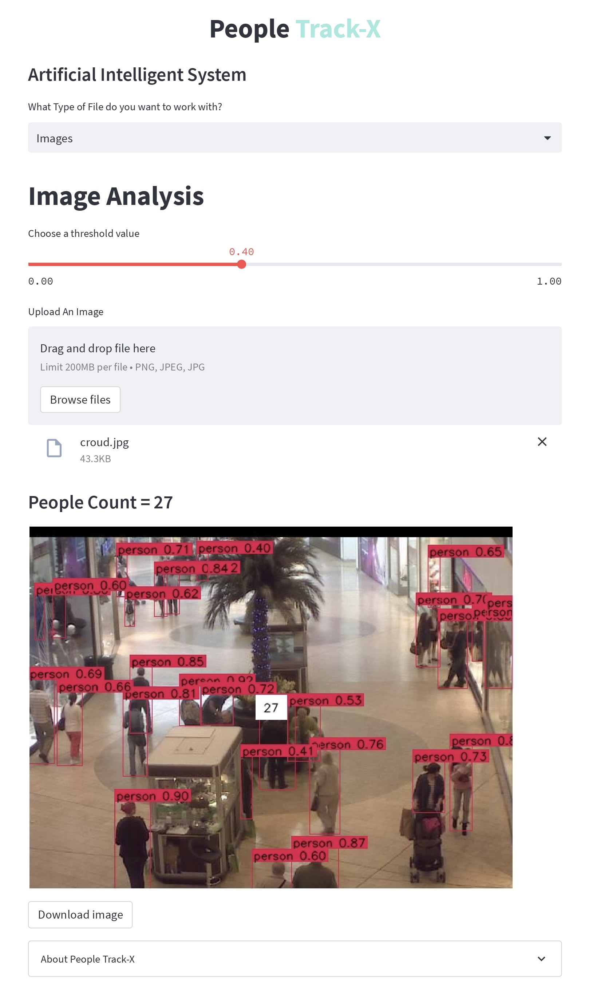
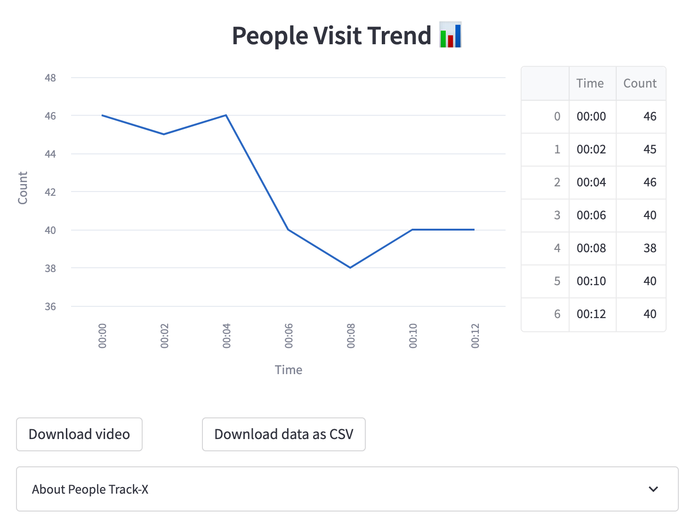

<h1 align="center">People <span style="color : #9eeade">Track-X</span></h1>

<p align="center" style="padding-left : 50px;padding-right : 50px; font-style : italic">
“An effienct way of crowd density analysis”
</p>

<div align="center">

[]()
[](/LICENSE)

</div>
<p align="center">
  <a href="" rel="noopener">
 </a>
</p>
<div align="center">
<p>Fig - An AI Generated Image</p>
</div>

---


<details>
<summary> Website UI Look
</summary>

</details>

<div align="center" >
  
  
  
  <p>Line Plot - Time vs Count.</p>
</div>

## Quick Start 🚀 :

### Method 01 - Using `virtual environment` 📦

1) Clone the Repository [People-Track-X](https://github.com/mahimairaja/People-Track-X)

```bash
git clone https://github.com/mahimairaja/People-Track-X.git

cd People-Track-X
```

2) Create a virtual environment

```bash
python -m venv env
```
   
3) Activate the virtual environment (Run according to your system)
```bash
source env/bin/activate 
# This is for linux or mac OS

.\env\Script\activate  
# This is for windows OS
```

3) Install the dependencies
```bash
pip install -r requirements.txt
```

4) Run the streamlit app
```bash
cd app

streamlit run app.py
```

### Method 02 - Using `Docker container 🚢` 

1) Clone the Repository [People-Track-X](https://github.com/mahimairaja/People-Track-X)

```bash
git clone https://github.com/mahimairaja/People-Track-X.git

cd People-Track-X
```

2) Build the container

```bash
docker build -t people-track-x .
```

2) Execute the container

```bash
docker run -p 8501:8501 people-track-x
```
----

### Algorithm 📝 : 
1. Object Detection - YoloV8
1. Object Tracking - Byte Tracker

---

### Acknowledgements

Special thanks to [Dr.Kumudha Raimond](#) for their invaluable guidance and support throughout the development of this project who has completed their PhD at the Indian Institute of Technology (IIT), Madras. 

---

## Licence <a name = "license"></a>

The contents of this project are Copyright (c) [Mahimai Raja J](https://www.linkedin.com/in/mahimairaja/). 

All rights reserved.


`While using kindly provide attribution by citing this repository.`


    @Inproceedings{People-Track-X,
    Authors : {Mr.Mahimai Raja J, Dr.Kumudha Raimond},
    repository : {https://github.com/mahimairaja/People-Track-X},
    Year : {2023}
    }


Thank you visiting !

Reach me 📩 - [Mahimai Raja J](https://www.linkedin.com/in/mahimairaja/) 
